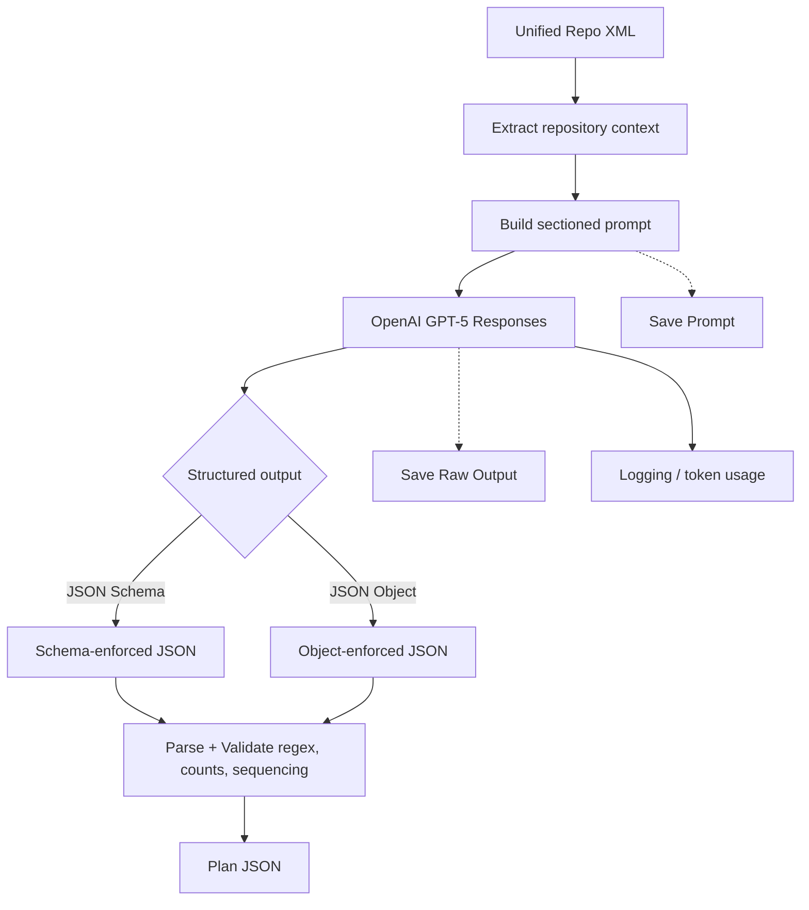

# Universal Task Planner 

[](#robustness-and-safety) [](#robustness-and-safety) [](#overview)

Elevate planning quality to an industry-leading standard. This CLI converts a high‑level feature request into a sequence of small, independently-mergeable pull requests (PRs) with concrete, testable tasks — using OpenAI GPT‑5 and a unified XML snapshot of your repository for deep, repo-aware guidance.

> Built for high reliability, strict JSON adherence, and automated consumption. Designed to set a new bar for PR planning robustness.

---

## Highlights

- ⚙️ Deterministic, sectioned prompt tuned for GPT‑5
- 🧩 Strict JSON output contract (no prose/markdown) with optional JSON Schema enforcement
- 🔢 Enforced PR naming (`{feature}-PR-01` … `-NN`) and task count bounds
- 🧭 Repository-aware planning via unified XML context (e.g., Repomix output)
- 🧪 Testing/CI validation required as final task in each PR
- 🔁 Robust API retries, timeouts, and clear logging (colorful output when `termcolor` is installed)
- 🧰 Powerful CLI controls for constraints, JSON mode, context length, and artifact saving

---

## Table of Contents

- [Overview](#overview)
- [Architecture](#architecture)
- [Quickstart](#quickstart)
- [Installation](#installation)
- [Inputs and Outputs](#inputs-and-outputs)
- [Sample Plan](#sample-plan)
- [CLI Usage](#cli-usage)
- [Prompt Design (Why it’s so reliable)](#prompt-design-why-its-so-reliable)
- [Robustness and Safety](#robustness-and-safety)
- [Advanced Recipes](#advanced-recipes)
- [Troubleshooting](#troubleshooting)
- [FAQ](#faq)
- [Contributing](#contributing)

---

## Overview

Universal Task Planner turns a short feature description into a high-fidelity PR plan tailored to your codebase. It reads a unified repository snapshot (XML), builds a strongly structured prompt, calls GPT‑5, and returns a strictly validated JSON plan ready for automation or human review.

```text
universal_planner/
├─ universal_task_planner.py   # CLI & core logic
├─ GitRepo-to-xml-output.xml   # Example repo snapshot (for context)
└─ README.md                    # This document
```

---

## Architecture

High-level flow from inputs to validated plan:



---

## Quickstart

1) Set your OpenAI API key (prefer environment var; `.env` is supported):

```bash
export OPENAI_API_KEY=sk-...
```

2) Run the planner (auto JSON Schema mode, save prompt and raw output):

```shell
python universal_task_planner.py \
  --xml GitRepo-to-xml-output.xml \
  --plan feature.md \
  --feature assignment-workflow \
  --output plans/assignment_plan.json \
  --json-mode auto \
  --save-prompt out/prompt.txt \
  --save-raw out/raw.txt
  
❯ python universal_task_planner.py \
  --xml GitRepo-to-xml-output.xml \
  --plan AssignmentWorkflowAssistant.md \
  --feature assignment-workflow \
  --output plans/assignment_plan.json \
  --json-mode auto \
  --max-tokens 15000 \
  --timeout 980 \
  --save-prompt out/prompt.txt \
  --save-raw out/raw.txt
[INFO] Context extracted: 508 chars
[INFO] Plan text read: 6921 chars
[INFO] Prompt constructed (9759 chars)
[INFO] Prompt saved to out/prompt.txt
[INFO] Structured response not supported; retrying without response_format.
[INFO] HTTP Request: POST https://api.openai.com/v1/responses "HTTP/1.1 200 OK"
[INFO] Token usage — input: 2017, output: 10276, total: 12293
[INFO] LLM response received
[INFO] Raw output saved to out/raw.txt
Plan written to plans/assignment_plan.json
~/EMA/universal_planner ❯                                                                                                     3m 33s universal_planner
  
```

3) Prefer piping your feature text? Use `--plan -`:

```shell
cat feature.md | python universal_task_planner.py \
  --xml GitRepo-to-xml-output.xml \
  --plan - \
  --feature assignment-workflow \
  --output plans/assignment_plan.json
```

---

## Installation

This project targets Python 3.11.

- Minimal deps:
  - `openai` (required)
  - `termcolor` (optional; for colorized logs; the script gracefully falls back if not installed)

Install with pip:

```bash
pip install openai termcolor
```

Or with `uv` (recommended):

```bash
uv pip install openai termcolor
```

> Tip: You can also create a virtual environment and install into it using `uv venv && uv pip install ...`.

---

## Inputs and Outputs

- Input A: Unified repository XML (e.g., produced by Repomix)
  - The planner extracts a concise context (prefers `<directory_structure>` and `<file_summary>`).
- Input B: Feature description (Markdown or plain text)
- Output: JSON array of PRs

Example output (truncated to illustrate shape):

```json
[
  {
    "pr_name": "assignment-workflow-PR-01",
    "pr_description": "Scaffold models, schemas, and base directories for the new assignment workflow.",
    "tasks": [
      "Create Pydantic v2 models for Assignment and Reviewer in app/models.",
      "Add FastAPI router scaffolding in app/api/assignments with empty handlers.",
      "Introduce basic tests and CI checks for scaffolding; ensure CI passes."
    ]
  }
]

ex: 
  [{
    "pr_name": "assignment-workflow-PR-01",
    "pr_description": "Bootstrap FastAPI service with project scaffolding and CI. Adds a health endpoint and testing setup to establish a baseline for subsequent features.",
    "tasks": [
      "Add pyproject.toml with dependencies (fastapi, uvicorn, pydantic v2, pydantic-settings, python-multipart, reportlab, Jinja2, pytest, httpx, requests) and create .gitignore to exclude venv/__pycache__/storage/.env.",
      "Create app/__init__.py and app/main.py with a FastAPI application and GET /health endpoint returning {'status':'ok'}.",
      "Create app/api/__init__.py and register a root APIRouter for future routes; wire router into app/main.py.",
      "Add .github/workflows/ci.yml to install dependencies (using pip) and run pytest on push/PR to main.",
      "Update run_app.sh to start the server with: uvicorn app.main:app --reload --host 0.0.0.0 --port 8000 and ensure it is executable.",
      "Add tests/test_health.py to assert GET /health returns 200 and JSON {'status':'ok'}; run pytest locally and ensure CI passes."
    ]
  }]
```

Constraints enforced:
- PR count: 6–12 (configurable)
- PR naming: `{feature}-PR-XX` where `XX` is `01..NN`, strictly sequential, no gaps
- Tasks per PR: 3–8 (configurable); final task focuses on tests/CI validation

---

## Sample Plan

- Path: `plans/sample_assignment_plan.json`
- Quick preview:

```json
[
  {
    "pr_name": "assignment-workflow-PR-01",
    "pr_description": "Scaffold core models, schemas, and directories for assignment workflow foundation.",
    "tasks": [
      "Create Pydantic v2 models for Assignment and Reviewer in app/models.",
      "Add base schemas in app/schemas with strict validation for Assignment create/update.",
      "Add minimal tests for models/schemas and ensure CI passes."
    ]
  }
]
```

---

## CLI Usage

```bash
python universal_task_planner.py -h
```

Key flags:
- `--xml`: Path to unified repository XML
- `--plan`: Path to feature description (use `-` to read from STDIN)
- `--feature`: Feature slug used in PR names (e.g., `assignment-workflow`)
- `--output`: Where to write the JSON plan
- `--json-mode`: `auto|schema|object|off`
  - `schema`: strict JSON Schema enforcement (best adherence)
  - `object`: JSON object output (less strict)
  - `auto`: try `schema`, fallback to `object`/plain
  - `off`: no structured hinting
- `--context-chars`: Truncate repo context to this many characters (default 2000)
- `--min-prs / --max-prs`: PR count bounds
- `--min-tasks / --max-tasks`: Tasks per PR bounds
- `--save-prompt`: Save the constructed prompt to a file
- `--save-raw`: Save raw LLM output for debugging
- `--temperature`, `--top-p`, `--max-tokens`, `--max-retries`, `--timeout`, `--reasoning`, `--model`

Examples:

- Strict JSON Schema with artifact saving:
  ```bash
  python universal_task_planner.py \
    --xml GitRepo-to-xml-output.xml \
    --plan feature.md \
    --feature assignment-workflow \
    --output plans/assignment_plan.json \
    --json-mode schema \
    --save-prompt out/prompt.txt \
    --save-raw out/raw.txt
  ```

- Custom bounds for large features:
  ```bash
  python universal_task_planner.py \
    --xml GitRepo-to-xml-output.xml \
    --plan big_feature.md \
    --feature assignment-workflow \
    --min-prs 8 --max-prs 15 \
    --min-tasks 4 --max-tasks 9 \
    --output plans/assignment_plan.json
  ```

---

## Prompt Design (Why it’s so reliable)

The prompt is intentionally sectioned and explicit to reduce ambiguity and contradictions:

- SYSTEM ROLE: Staff-level engineer/planner persona
- GLOBAL CONTROLS: Low verbosity, low agentic eagerness, JSON-only output
- REPOSITORY CONTEXT: Unified XML, emphasizes directory structure for correct file placement
- FEATURE DESCRIPTION: The ask from product/engineering
- CONSTRAINTS: PR count, naming regex, tasks per PR, acyclic dependencies, repo conventions
- OUTPUT CONTRACT: JSON array with `pr_name`, `pr_description`, `tasks` only
- INTERNAL SELF-CHECK (not printed): Validate counts, regex matches, numbering continuity, and final test/CI task

This design mirrors structured output (JSON Schema) to reinforce correctness from both the prompt and API sides.

---

## Robustness and Safety

- Structured output: JSON Schema via `response_format` when supported; graceful fallback
- Strict validation: PR count bounds, naming regex, task list sizes, numbering continuity
- Retries + timeouts: Exponential backoff with jitter
- Token usage logs (when available)
- Security: Use environment variables for API keys (prefer over `.env`); never commit secrets

---

## Advanced Recipes

- Pipe feature text from tools:
  ```bash
  some-generator | python universal_task_planner.py --xml repo.xml --plan - --feature my-feature --output plan.json
  ```

- Save artifacts for auditability:
  ```bash
  python universal_task_planner.py ... --save-prompt out/prompt.txt --save-raw out/raw.txt
  ```

- Quickly tweak constraints for different team sizes/sprints:
  ```bash
  python universal_task_planner.py ... --min-prs 5 --max-prs 10 --min-tasks 2 --max-tasks 6
  ```

---

## Troubleshooting

- `OPENAI_API_KEY is not set`:
  - Set it as an environment variable (recommended). `.env` is supported but less preferred.

- Model returns prose instead of JSON:
  - Use `--json-mode schema` or `--json-mode object` and keep temperature low (default 0.2).

- Output fails validation (e.g., numbering gap or task count):
  - Re-run; the prompt includes a self-check and schema enforcement (when available). Adjust `--max-tokens` if truncation suspected.

- `response_format` not accepted by your SDK/model:
  - Use `--json-mode off` or `auto` to fallback gracefully.

---

## FAQ

- Why a sectioned prompt instead of a single block?
  - Reduced ambiguity, fewer contradictions, and higher JSON adherence. It’s more maintainable and mirrors the JSON Schema contract.

- Why require a final test/CI task in each PR?
  - To keep every change independently verifiable and to maintain quality in incremental delivery.

- Can I use this beyond TalentPulse360?
  - Yes. The conventions are general and the XML context makes the plan repository-aware.

---

## Contributing

- Issues and PRs are welcome. Keep changes backward-compatible and avoid removing existing functionality.
- Follow PEP 8; prefer small, reviewable diffs. When adding dependencies, document them here.
- Do not include secrets in examples or tests.

---

Made with care by rajeshkanaka to set a new standard in prompt‑driven planning. 🚀
